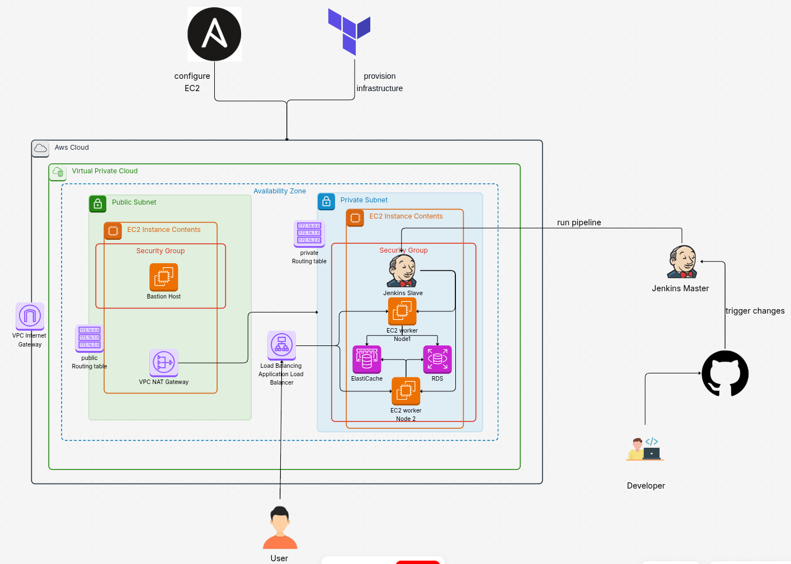

# 🚀 DevOps Node.js Jenkins AWS

## Project Title:

**End-to-End DevOps Pipeline for Scalable Node.js Application with Jenkins, RDS, Redis, and Load Balancer on AWS**

## 📖 Overview

This project demonstrates a complete DevOps workflow to deploy a scalable Node.js application using:

- **Ansible** for EC2 configuration
- **Jenkins** for CI/CD pipelines
- **Terraform** for AWS infrastructure provisioning
- **Application Load Balancer (ALB)** for exposure on port 80
- **RDS & Redis** for data persistence and caching
- **Bastion Host** to access private EC2s securely

The Node.js app is deployed on a private EC2 instance and is accessed publicly through an ALB. Jenkins handles the deployment via SSH to the slave.

---

## 🧰 Tech Stack

| Layer            | Tool/Service               |
| ---------------- | -------------------------- |
| Infrastructure   | Terraform                  |
| Configuration    | Ansible                    |
| CI/CD            | Jenkins (Pipeline)         |
| Application      | Node.js (Express)          |
| Data Persistence | Amazon RDS (PostgreSQL)    |
| Caching          | Amazon ElastiCache (Redis) |
| Network          | AWS VPC, ALB, Bastion      |

---

## infrastructure



## 🔁 Fork & Clone the Repo

1-Fork this repo: https://github.com/sallmayasser/nodejs-ci-cd-pipeline-aws.git

2-Clone your fork:

```
git clone https://github.com/sallmayasser/nodejs-ci-cd-pipeline-aws.git
cd jenkins-devops-project
```

## 🚀 Project Setup

### ✅ Step 1: run master container with pv

```
docker container run -d -v jenkins_home:/var/jenkins_home -p 8080:8080 --name jenkins_master jenkins/jenkins:lts
```

## Step 2: Run the deploy script

in this path ./jenkins-devops-project run :

```
./scripts/deploy.sh <db_username> <db_password>
```

this script run the following :

1. Terraform apply
2. Extract the output in separte file
3. Write the inventory file
4. configure the ~/.ssh/config file
5. Run the main playbook to configure jenkins slaves
6. Enable port forwarding on bastion
7. Starting reverse SSH tunnel from local to Bastion Host

Deploy script output <br>


## Step 3: Add bastion host as Reverse proxy on dashboard

open manage --> system --> jenkins location (Add the Bation IP )<br.>


## Step 4: Configure the jenkins slave node manually on dashboard

Get the agent setup script from: Manage Jenkins --> Nodes --> New Node:


Then on the Jenkins slave

```
curl -sO http://<Bastion host ip>:8080/jnlpJars/agent.jar
java -jar agent.jar -url http://<Bastion host ip>:8080/ -secret 025caeda5d0d510e3123754da8d357ea2fc96b6df39c93cfa79b23d5200477b4 -name "aws-slave" -webSocket -workDir "/home/ubuntu/jenkins"
```


## Step 5: Create github webhook and pipeline on jenkis

- create pipeline


- create pipeline
  new item --> pipeline --> triggers --> Github hook
  

## Step 6: Push Changes on Github & Trigger Pipeline
- pushing the code 
 

- the pipeline output
 

## Step 7: Verify pipeline stages on slack


## 🧑‍💻 Author

salma yasser <br>
DevOps Engineer | Cloud Infrastructure Specialist <br>
📧 [sallmayasser512@gmail.com](mailto:sallmayasser512@gmail.com) <br>
🔗 [LinkedIn](https://www.linkedin.com/in/sallma-yasser)
